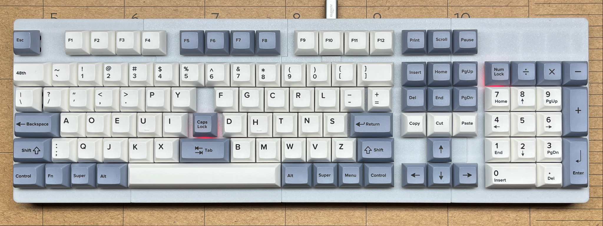

# mx-switch-custom
Library files for KiCad PCB design software.

Custom Cherry MX footprints compatible with the native KiCad library and a Maple Elite-Pi symbol and footprint. 

These footprints allow keyboard designers to abandon the jagged 150-year old mechanical typewriter horizontal keystagger and 
create uniform linear angled key columns within straight rows of keys.

Availability of keycap sets:

I have been subsituting common keycaps sizes from large XDA keycap sets, and relabeling them with keycap stickers as needed.

YUZU custom keycaps will make any die-sub keycap set that your heart desires. Common sizes still have to be sustituted. Being able to choose 
keycap sizes, colors, and legends is 'just what the doctor ordered'. I have designed and bought five sets in two months. Even with the new 
high tariffs, the price is a affordable. Good quality product.

Link to my repo of modern writing instruments: [Writerz With an Attitude](https://github.com/Dholydai/writerz-with-an-attitude)

Ronald Earl Walker
