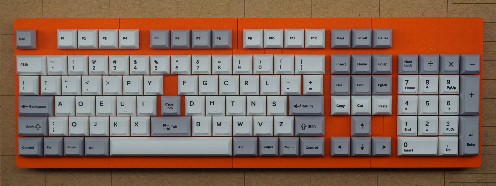

# mx-switch-custom
Library files for KiCad PCB design software.

Custom Cherry MX footprints compatible with the native KiCad library. A Maple Elite-Pi symbol and footprint. 

These custom width footprints allow keyboard designers to create uniform linear angled key columns within straight rows of keys.

Quality of key switches:

Cherry MX switches have great quality. I build all of my keyboards with Cherry switches.

Availability of keycap sets:

I have been subsituting common keycaps sizes for the exotic sizes required. I buy large XDA keycap sets, and relabel selected keycaps with keyboard 
stickers as needed. Buying a 6U XDA spacebar is possible, the parts I bought come with 1\2U offset stems (my staggered MX footprint works with that). 

The custom keycap set shown above was produced by YUZU custom keycaps. Simon will make any die-sub keycap set that your heart desires. Common sizes still have to be sustituted. Being able to choose keycap 
sizes, colors, and legends is game changing. I have designed and bought nine sets. Good quality product.

Link to my repo of modern writing instruments: [Writerz With an Attitude](https://github.com/Dholydai/writerz-with-an-attitude)

Ronald Earl Walker - Inventor of the Post-Mechanical keyboard
